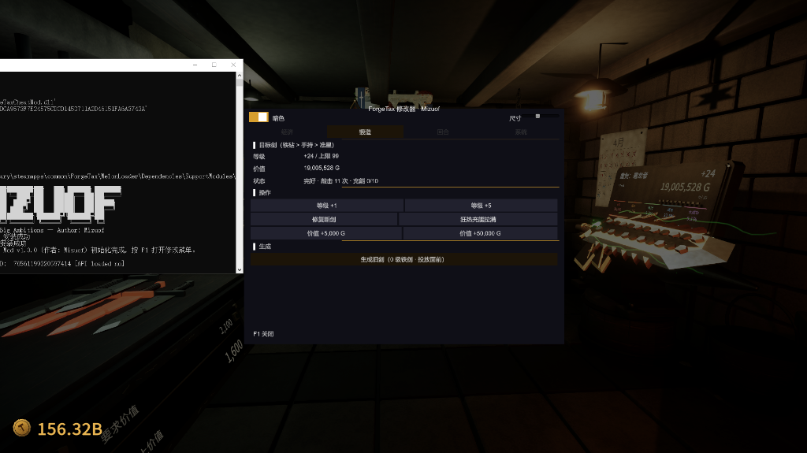

# ForgeTax Cheat Mod — ForgeTax 多功能修改器

ForgeTax 的 MelonLoader Mod — 内置修改模组，按 **F1**（或 **Insert**）打开。



## 安装方法

### 1. 安装 MelonLoader

下载 MelonLoader.Installer：

[MelonLoader.Installer.exe 下载](https://github.com/LavaGang/MelonLoader/releases)

> 或用浏览器打开 [Release 页面](https://github.com/LavaGang/MelonLoader/releases) 自行选择版本。

打开 MelonLoader.Installer，按以下步骤操作：

1. 在列表中找到 **ForgeTax**（或手动选择游戏 exe）
2. **Install**（本项目开发环境为 **v0.7.2 Open-Beta**，Mono 后端）
3. 安装完成后，**运行一次游戏**，进入主界面再退出（首次运行会生成必要文件）
4. 游戏根目录出现 `MelonLoader/` 和 `Mods/` 文件夹即安装成功

> **如果控制台报错或安装失败**：卸载后尝试降低 MelonLoader 版本（例如 v0.7.1）。

### 2. 安装 Mod

将 `ForgeTaxCheatMod.dll` 放入游戏根目录的 `Mods/` 文件夹。

### 3. 启动

启动游戏，进入锻造坊后按 **F1** 打开修改面板。

## Steam 游戏根目录快速定位

Steam 库 → 右键 **ForgeTax** → 管理 → 浏览本地文件。

## 快捷键

| 按键 | 功能 |
|------|------|
| **F1** / **Insert** | 打开/关闭修改面板 |
| 点击面板外区域 | 吞掉点击，不穿透到游戏 |

## 功能面板

| Tab | 功能 |
|---|---|
| **经济** | 快捷加金币 (1K/10K/100K)，剑之铭刻（商店货币）+1/+10/+100 |
| **锻造** | 目标剑（铁砧 > 手持 > 准星）等级 +1/+5，修复断剑，狂热充能拉满，价值提升 (5K/50K)，**生成旧剑**（0 级铁剑投放面前，不计图鉴/成就） |
| **回合** | 战斗保护开关（剑永不损毁 / 每次敲击必大成功 / 结算强制成功），清除违约，重置商店刷新，契约期限 +10 回合，无尽模式，消耗品补充（守护/回溯/粉笔/锻粉/星尘） |
| **系统** | 立即存档，游戏速度 (0.25x~3x)，界面刷新，**赞助作者**按钮 |

> 所有开关实时生效，关闭即恢复原生行为；面板支持暗色/亮色主题切换、四色强调切换、尺寸缩放。

## 界面定制

- **主题**：代码动态构建 GUISkin，纯色直角高对比设计，黑白主题 / 四色强调 / 尺寸缩放实时可调
- **输入**：自动兼容 Unity 旧输入与 Input System 包（Unity 6 双模式探测降级）

## 游戏技术栈

| 技术 | 用途 |
|------|------|
| **Unity 6000.5.5f1** | 游戏引擎（MonoBleedingEdge 后端） |
| **MelonLoader v0.7.2** | Mod 加载器 |
| **Assembly-CSharp.dll** | 游戏主逻辑程序集（全 public，强引用直连） |

## 构建

```bash
dotnet build ModSource/ForgeTaxCheatMod.csproj -c Release
```

输出：`ModSource/Mods/ForgeTaxCheatMod.dll`（仅一个 DLL）

需要 .NET SDK 8/10（目标 `net48`）+ 游戏引用（`MelonLoader/net35/MelonLoader.dll`、`ForgeTax_Data/Managed/*.dll`）。游戏安装在非默认路径时，修改 `ForgeTaxCheatMod.csproj` 中各 `<HintPath>` 为实际路径。

## 模块列表

| 文件 | 功能 |
|------|------|
| `ModSource/Main.cs` | 主入口 + F1/Insert 快捷键 + 光标管理 + MIZUOF banner |
| `ModSource/Core/Config.cs` | MelonPreferences 配置管理（配置键集中定义） |
| `ModSource/Core/Theme.cs` | 主题系统（四色强调/黑白主题/尺寸缩放/滚动条美化） |
| `ModSource/Data/GameService.cs` | 游戏数据访问（房间/战役/目标剑定位） |
| `ModSource/Features/Patches.cs` | Harmony 补丁（结算强制成功/剑永不损毁/必大成功） |
| `ModSource/Features/Actions.cs` | 功能动作集（经济/回合/锻造/生成/系统） |
| `ModSource/Rules/FeatureRegistry.cs` | 功能注册表与状态机 |
| `ModSource/UI/ModMenu.cs` | 主窗口（四域 Tab 渲染 + 熔断排栈） |
| `ModSource/UI/Components.cs` | IMGUI 组件库（开关/按钮/滑条/状态点） |

---

**作者**: Mizuof  
**Web**: [https://github.com/Mizuof](https://www.mizu7.top/archives/thankyou)

*本修改器完全免费，请勿用于商业用途。*
